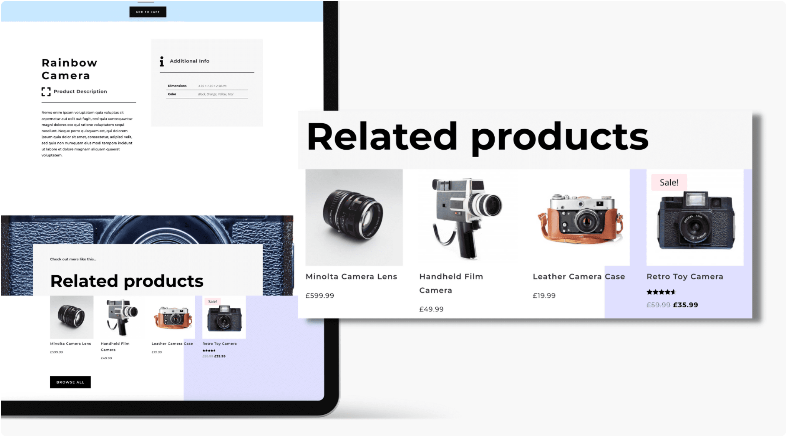
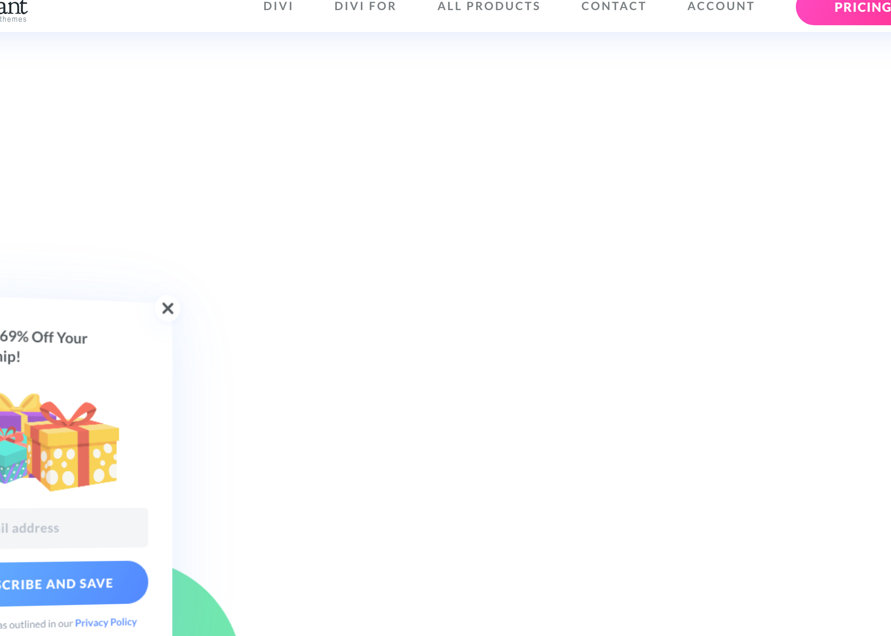

# Woo Related Products

The Woo Related Products module displays related WooCommerce products on product pages to encourage additional browsing and purchases.

!!! abstract "Quick Reference"
    **What it does:** Shows products related to the current product based on shared categories and tags.
    **When to use it:** Product page templates in the Theme Builder
    **Key settings:** Text styling, CSS customization, Visibility
    **Block identifier:** `divi/woo-related-products`
    **ET Docs:** [Official documentation](https://www.elegantthemes.com/documentation/divi/woo-related-products/)

!!! tip "When to Use This Module"
    - Building custom product page templates with a "You may also like" section
    - Increasing product page engagement and average order value
    - Keeping customers browsing by showing category-related products

!!! warning "When NOT to Use This Module"
    - On non-product pages → related products require a product context
    - For cross-sell suggestions on the cart page → use [Woo Cross Sells](woo-cross-sells.md)
    - For manually curated product grids → use [Shop](shop.md) or [Woo Products](woo-products.md)

## Overview

How to add, configure and customize the Divi Woo related products module.

The Divi Woo Related Products Module fully integrates with WooCommerce capabilities and displays related products to the product you’re viewing. It’s great to include it on product pages to help increase sales and conversions. The Divi Woo Related Products module is one of the building block modules for creating customized eCommerce pages in the Theme Builder.

Before we can use the Divi Woo Related Products module you’ll need to have bothDiviandWooCommerceinstalled on your website. Once you have the Divi theme installed and activated, we can begin using the features and functionalities of Divi.

<!-- TODO: Replace with proper screenshot -->
<!-- { loading=lazy } -->
<!-- *The Woo Related Products module as it appears in the Divi 5 Visual Builder.* -->

## Settings & Options

### Content Tab

<!-- TODO: Verify all Content tab settings for Woo Related Products module -->

| Setting | Type | Default | Description |
|---------|------|---------|-------------|
| WooCommerce Performance Optimization | text | — | 14 Tips & Best Practices |
| Updating WooCommerce | text | — | Best Practices to Follow Every Time |

<!-- TODO: Replace with proper screenshot -->
<!-- { loading=lazy } -->

### Design Tab

<!-- TODO: Verify all Design tab settings for Woo Related Products module -->

| Setting | Type | Default | Description |
|---------|------|---------|-------------|
| <!-- TODO: Document Design settings --> | | | |

<!-- TODO: Replace with proper screenshot -->
<!-- { loading=lazy } -->

### Advanced Tab

<!-- TODO: Verify all Advanced tab settings for Woo Related Products module -->

| Setting | Type | Default | Description |
|---------|------|---------|-------------|
| CSS ID | text | — | Assign a unique CSS ID to the module |
| CSS Class | text | — | Assign CSS classes to the module |
| Custom CSS | code | — | Add custom CSS directly to the module's elements |
| Visibility | toggle | Show on all devices | Control device visibility (desktop, tablet, phone) |
| Transition | select | Default | Animation transition style for hover effects |

## Code Examples

### Custom CSS

```css
/* Style the Woo Related Products module */
.et_pb_wc_related_products {
    /* Add your custom styles */
    margin-bottom: 30px;
}

/* Responsive adjustments */
@media (max-width: 980px) {
    .et_pb_wc_related_products {
        padding: 20px;
    }
}
```

### PHP Hooks

```php
/* Filter the Woo Related Products module output */
add_filter('et_module_shortcode_output', function($output, $render_slug) {
    if ('et_pb_et_pb_wc_related_products' !== $render_slug) {
        return $output;
    }
    // Modify $output as needed
    return $output;
}, 10, 2);
```

## Common Patterns

<!-- TODO: Add 2-3 real-world usage patterns with screenshots -->

1. **Basic Usage** — Add the Woo Related Products module to any row in the Visual Builder and configure its settings.

2. **Styled Variation** — Use the Design tab to customize fonts, colors, and spacing to match your site's design system.

3. **Dynamic Content** — Use dynamic content fields to pull data from custom fields or post meta.

## Version Notes

!!! note "Divi 5 Only"
    This page documents Divi 5 behavior exclusively.

## Troubleshooting

!!! warning "Module Not Rendering"
    If the Woo Related Products module doesn't appear on the front end, verify that:

    - The module is not inside a disabled section or row
    - Visibility settings aren't hiding it on the current device
    - Any required fields (like URLs or content) are filled in

<!-- TODO: Add module-specific troubleshooting items -->

## Related

<!-- TODO: Add related module links -->
