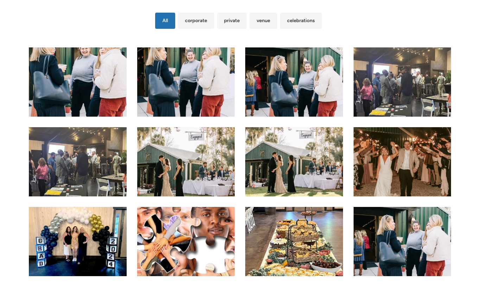
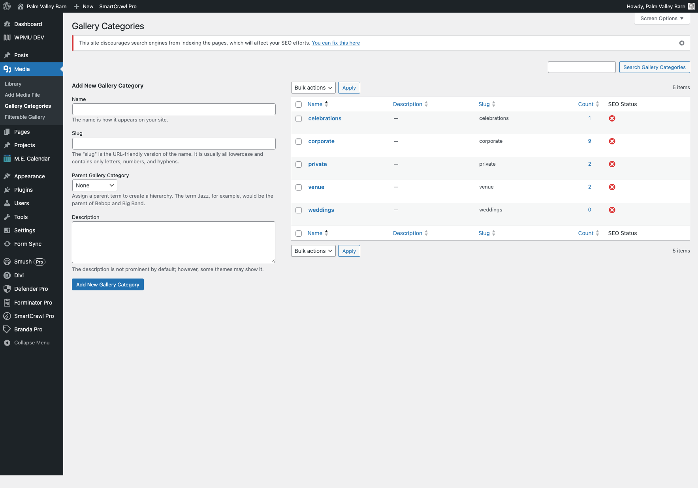
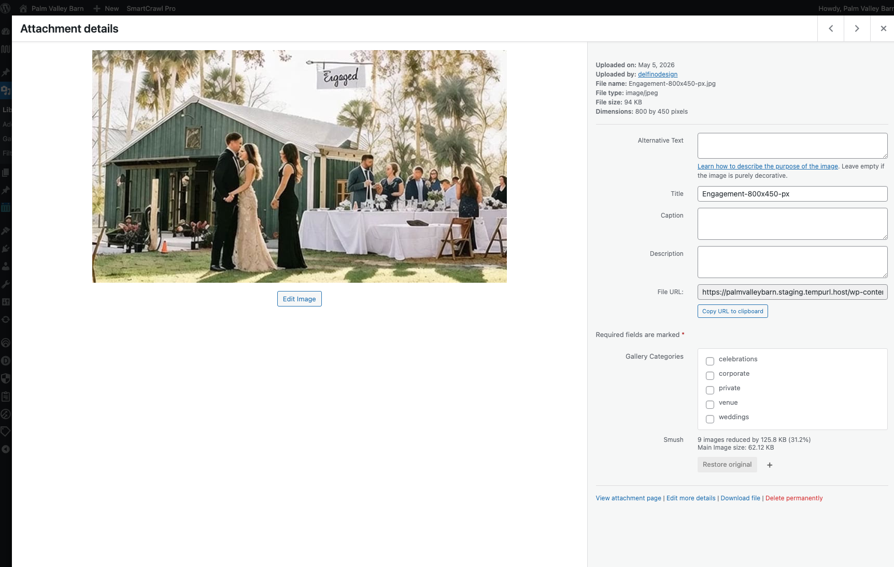
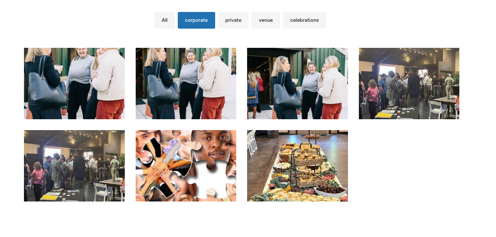
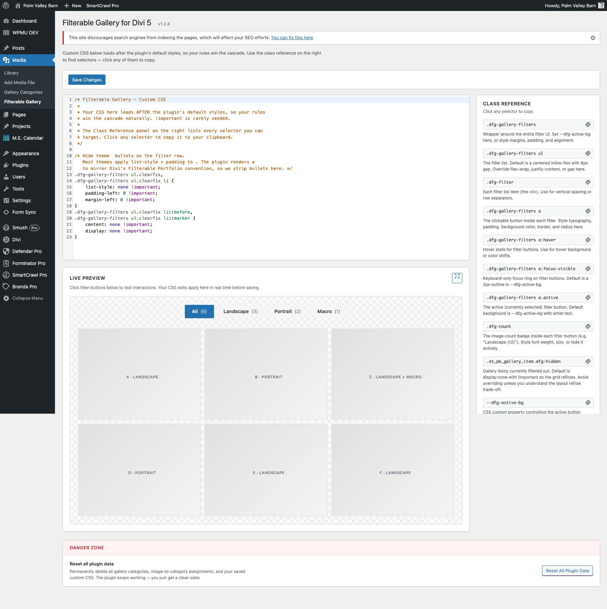

# Divi 5 Filterable Gallery

Tag images once in the WordPress Media Library, then drop a shortcode above any Divi 5 Gallery module to add native-styled filter buttons. No new module, no jQuery, no replacement gallery system — the standard Divi 5 Gallery still renders normally and the plugin layers filtering on top.

!!! abstract "Quick Reference"
    **What it does:** Adds a `gallery_category` taxonomy to attachments and renders filter buttons that show/hide images in any Divi 5 Gallery module on the same page.

    **When to use it:** Any page with a multi-category gallery — venue galleries (interior/exterior/grounds), product showcases (color/material/season), portfolios (landscape/portrait/macro), team pages (department/role), event archives.

    **Plugin slug:** `divi5-filterable-gallery`
    **Shortcode:** `[dfg_gallery_filters]`
    **Settings page:** Media → Filterable Gallery
    **License:** GPL-2.0-or-later

!!! tip "When to Use This Recipe"
    - You have a single Divi Gallery with images that fall into clear categories
    - You want visitors to filter without leaving the page or hitting the lightbox
    - You want the filter UI to look like Divi's native [Filterable Portfolio](../modules/filterable-portfolio.md) module so it feels at home in the design

!!! warning "When NOT to Use This Recipe"
    - You're filtering blog posts or custom-post-type entries → use [Filterable Portfolio](../modules/filterable-portfolio.md) directly
    - You need image-level filtering across multiple galleries on the same page → the plugin filters all gallery items in the DOM, so two galleries on one page would get filtered together
    - The gallery uses Divi's pagination (`Images Per Page` is set) — filtering only operates on items currently in the DOM, so paginated images won't appear when their category is selected (see Troubleshooting)

## Overview

Divi 5 ships a Gallery module and, separately, a Filterable Portfolio module. The two don't overlap. Galleries pull from the Media Library. Filterable Portfolio pulls from the Projects post type. If you have a media-driven gallery that needs category filtering, the standard answer has been "use Filterable Portfolio instead, and convert all your images to Project posts" — which is heavy lifting for what should be a simple feature.

This recipe walks through a small WordPress plugin that adds the missing piece: a `gallery_category` taxonomy on attachments, plus a shortcode that renders filter buttons matching Divi's native `et_pb_portfolio_filters` styling. Tagging images happens in the Media Library where you already manage them. The Gallery module continues to do exactly what it does today. The plugin just teaches the page how to show and hide images by category on click.

The plugin is designed to be visually invisible — its filter buttons mirror Divi's Filterable Portfolio convention closely enough that visitors won't notice they're looking at a third-party shortcode and not a Divi module.

{ loading=lazy }
*The plugin's filter buttons rendered above a standard Divi 5 Gallery module.*
<!-- TODO: capture screenshot of filter buttons + gallery on a live page -->

## Use Cases

1. **Multi-room venue gallery.** A wedding venue with one gallery section that needs Interior, Exterior, Ceremony, Reception, and Detail filters. Each photo gets tagged with one or more categories. Visitors land on All by default and filter as they explore.

2. **Product variant showcase.** A furniture maker with a gallery of one chair design in 8 colors and 3 materials. Tag each photo with the relevant color and material categories so visitors can filter by either dimension.

3. **Portfolio without post types.** A photographer who keeps their portfolio in the Media Library rather than as Project posts. Tag each shot with its category (Landscape, Portrait, Macro, Architecture) and let visitors filter without converting to a custom post type.

4. **Event archive.** A nonprofit with hundreds of past-event photos in one gallery. Tag by year or event type. Visitors filter to find specific events without scrolling through everything.

## Installation

### Get the plugin

The plugin source is published at the link in the [Plugin Source](#plugin-source) section at the bottom of this page. Download the `.zip` file from the latest release.

### Install on your WordPress site

1. **In WP admin:** Plugins → Add New → Upload Plugin → choose the `.zip` file → Install Now → Activate.

2. **Or via SFTP:** Unzip locally, upload the `divi5-filterable-gallery/` folder to `wp-content/plugins/`, then activate from the Plugins screen.

On activation, the plugin registers the `gallery_category` taxonomy and seeds a default custom CSS option that suppresses theme bullet styles on the filter row. Your existing taxonomy data and image taggings persist across deactivation and across plugin upgrades.

### Verify it's working

After activation, you should see two new things in WP admin:

1. **Media → Gallery Categories** — manage your category terms here
2. **Media → Filterable Gallery** — settings page with custom CSS editor and live preview

If either is missing, deactivate and reactivate the plugin to re-register the menu items.

## Tagging Images in the Media Library

Tagging happens directly in the Media Library — no separate management screen.

### Step 1 — Create your categories

Open **Media → Gallery Categories**. Add the categories you'll use for filtering (e.g., Interior, Exterior, Ceremony). The taxonomy is hierarchical, so you can nest categories if needed (e.g., Outdoor → Garden, Outdoor → Patio).

{ loading=lazy }
*The Gallery Categories admin screen at Media → Gallery Categories.*
<!-- TODO: capture screenshot of the taxonomy management screen -->

### Step 2 — Tag your images

Open the Media Library in either grid or list view. Click any image to open the attachment details panel. You'll see a new **Gallery Categories** section with checkboxes for every term you defined.

{ loading=lazy }
*The Gallery Categories checkbox UI in the attachment details panel.*
<!-- TODO: capture screenshot of attachment details modal with checkboxes -->

Check every category that applies. Each image can belong to multiple categories — a photo of an outdoor ceremony might be tagged Exterior, Ceremony, and Garden simultaneously.

The plugin replaces WordPress core's default comma-separated text input with proper checkboxes. Core renders custom taxonomies as plain text on attachment screens regardless of the `hierarchical` setting — that's a long-standing core limitation the plugin works around.

### Step 3 — Verify category counts

Back at **Media → Gallery Categories**, the Count column shows how many images are tagged with each category. If a category shows zero images you know to tag some — and the filter button for that category will be hidden until at least one image is tagged.

## Adding the Filter UI to a Page

The filter UI is a shortcode you place above any Divi Gallery module on the same page.

### Step 1 — Drop in the shortcode

In the Visual Builder, add a Code module immediately above your Gallery module (or anywhere above it in the page flow — the shortcode and the gallery just need to share a page). Paste this into the Code module:

```text
[dfg_gallery_filters]
```

That's the entire shortcode. No attributes, no configuration.

### Step 2 — Save and view

Save the page and view it on the front end. You should see:

- An **All** button on the left, marked active by default
- One button per Gallery Category that has at least one image tagged
- Buttons sorted by image count, descending
- A small `(N)` badge next to each category showing its image count

Clicking a button hides every gallery image not tagged with that category. Visible images reflow up to fill the grid (the plugin uses `display: none` on hidden items, matching how Divi's native Filterable Portfolio behaves). Clicking **All** restores the full set.

{ loading=lazy }
*The rendered filter row sitting above a Divi Gallery module.*
<!-- TODO: capture screenshot of the rendered filter UI -->

### Pre-filtered URLs

Append `?filter=category-slug` to the page URL to land visitors on a specific filter. Example:

```text
https://yoursite.com/portfolio/?filter=landscape
```

The page loads with the Landscape filter pre-applied. This makes filtered views shareable — paste the link into emails, social posts, or navigation menus and visitors land on the right slice.

## Settings Page Tour

The plugin's settings page lives at **Media → Filterable Gallery**. Three sections:

### Custom CSS editor

A CodeMirror-powered editor on the left for your CSS overrides. Whatever you save here loads on the front end inside `<style id="dfg-custom-css">` at `wp_head` priority 100 — meaning it loads AFTER the plugin's default styles, so your rules win the cascade naturally without `!important`.

The editor seeds itself with a bullet-fix block on first activation (themes that style `<ul>` aggressively can leak bullets onto the filter row; the seed CSS suppresses that). The editor tracks unsaved changes and warns before navigating away if you have unsaved edits.

{ loading=lazy }
*The settings page with the CodeMirror editor on the left and class reference on the right.*
<!-- TODO: capture screenshot of the settings page -->

### Class reference panel

The right panel lists every CSS selector the plugin renders, with a click-to-copy button on each one. Clicking copies the selector to your clipboard so you can paste it into the editor. Selectors include the wrapper, list, individual filter buttons, hover/focus/active states, the count badge, the hidden-item state, and the `--dfg-active-bg` CSS variable.

### Live preview pane

Below the editor, a sandbox preview renders six mock gallery items and the filter UI using the plugin's actual styles. As you edit CSS in the editor above, the preview updates in real time — before you save, before you reload, before you leave the page. Click any filter button in the preview to test interactions and see hover/active/transition behavior with your CSS applied.

This means the typical iterate-style-and-check loop happens entirely on the settings page. You don't need to alt-tab to a frontend tab and refresh.

### Danger Zone

At the bottom of the settings page, a red-bordered Danger Zone section with one button: **Reset All Plugin Data**. Clicking it opens a confirmation modal that explains exactly what gets deleted (gallery_category terms, image-to-category assignments, custom CSS) and requires you to type `RESET` to enable the destructive button.

The reset deletes via a nonce-protected, capability-gated AJAX endpoint and re-seeds the default CSS so the plugin keeps working with a clean slate. Use this when you want to start over completely — for example, when restructuring a category schema rather than incrementally renaming.

The plugin does NOT delete data on uninstall. The `uninstall.php` is intentionally empty so deleting the plugin via WP admin Plugins → Delete preserves your taxonomy. The Danger Zone is the only path to a full data wipe.

## Customizing the Styles

The plugin renders filter buttons with the same DOM structure Divi uses for `et_pb_portfolio_filters`, so styling tricks you already know from the Filterable Portfolio module work directly.

### Quick override — change the active button color

Open Media → Filterable Gallery and add this to the editor:

```css
.dfg-gallery-filters {
    --dfg-active-bg: #c4a572;
}
```

The active filter button background changes immediately in the live preview. Save to apply on the front end. The variable also drives the keyboard focus ring color, so both states stay consistent.

### Restyle the buttons completely

```css
.dfg-gallery-filters a {
    background: transparent;
    border: 2px solid #333;
    color: #333;
    border-radius: 0;
    text-transform: uppercase;
    letter-spacing: 0.05em;
    font-size: 0.75rem;
    padding: 8px 16px;
}

.dfg-gallery-filters a:hover {
    background: #333;
    color: #fff;
}

.dfg-gallery-filters a.active {
    background: #333;
    color: #fff;
}
```

This produces a minimal outlined-button style that fits a luxury-brand aesthetic.

### Treat "All" differently

Sometimes you want the All button to read as a reset action rather than a category. Target it specifically:

```css
.dfg-filter[data-filter="all"] a {
    background: transparent;
    border: none;
    color: #666;
    text-decoration: underline;
}

.dfg-filter[data-filter="all"].active a {
    background: transparent;
    color: #000;
    text-decoration: none;
}
```

For the full selector reference, click any selector in the right-pane class reference on the settings page.

## Architecture Notes

The plugin breaks into three layers, intentionally kept independent so each can be reasoned about separately.

### Layer 1 — Taxonomy

A custom hierarchical taxonomy `gallery_category` registered against the `attachment` post type. Visible in the Media Library admin column, exposed via REST API, surfaces under the Media menu. Two non-obvious choices:

- **`update_count_callback => '_update_generic_term_count'`** — attachments are `post_status=inherit`, not `publish`. The default count callback only counts `publish` posts, so term counts on attachment taxonomies stay stuck at zero. The generic counter ignores status and counts all related objects.
- **Hierarchical = true** — gives you nested categories AND tells WordPress to render the term-edit UI on the attachment edit screen as something more than a comma-separated text input. Even with `hierarchical => true`, the attachment details modal still renders custom taxonomies as plain text — which is why Layer 1b exists.

### Layer 1b — Attachment metabox override

A pair of filters (`attachment_fields_to_edit` and `attachment_fields_to_save`) that replace WordPress core's default comma-separated text input for the `gallery_category` taxonomy with a proper checkbox UI. A hidden marker field lets the save filter distinguish "user unchecked everything" from "this form wasn't rendered for this attachment at all."

### Layer 2 — Output filter

A `render_block` callback hooks into Divi 5's gallery render pipeline (`render_slug=et_pb_gallery`, block name `divi/gallery`). For each gallery on the page, it walks the rendered HTML, finds each gallery item by class, looks up the underlying attachment ID, and injects `data-categories="slug-1,slug-2"` attributes onto the wrapper element.

A `et_module_shortcode_output` callback does the same for any Divi 4 fallback rendering paths still in use during the migration period.

The non-obvious bit: Divi 5 wraps each gallery image in BOTH `et_pb_gallery_item` (outer) AND `et_pb_gallery_image` (inner). The outer is the togglable element (it has `style="display: block;"`). The XPath in the output filter matches either via an `or` clause so we don't miss either wrapper format.

### Layer 3 — Frontend filter UI

A shortcode (`[dfg_gallery_filters]`) renders the filter button list. Frontend JavaScript (vanilla, no jQuery) walks all gallery items in the DOM on click, comparing each item's `data-categories` attribute to the active filter, and toggles a `.dfg-hidden` class. CSS handles the transition.

Two notable choices:

- **Buttons sort by count, descending** — the most-populated category leads, with All always pinned first as a reset.
- **URL parameter support** — `?filter=slug` triggers the matching filter on page load, before any user interaction. Makes filtered views shareable.

## Troubleshooting

!!! warning "Filter buttons show theme bullets (•) on the left"
    Some themes apply `list-style: disc` and `padding-left` to all `<ul>` elements with strong specificity. The plugin's default styles already set `list-style: none`, but theme rules can override them.

    **Fix:** The plugin's settings page seeds a bullet-suppression CSS block on first activation. If you've cleared your custom CSS or the seed didn't apply, paste this into Media → Filterable Gallery:

    ```css
    .dfg-gallery-filters ul.clearfix,
    .dfg-gallery-filters ul.clearfix li {
        list-style: none !important;
        padding-left: 0 !important;
        margin-left: 0 !important;
    }
    .dfg-gallery-filters ul.clearfix li::before,
    .dfg-gallery-filters ul.clearfix li::marker {
        content: none !important;
        display: none !important;
    }
    ```

!!! warning "Pagination + filtering doesn't work"
    The frontend JavaScript only filters items currently in the DOM. If your Gallery module has `Images Per Page` set to anything less than the total image count, items on later pages aren't in the DOM until you click pagination — and clicking a filter then misses them.

    **Workaround:** Set `Images Per Page` to a number larger than your total image count, effectively disabling pagination. The page becomes longer but the filter works correctly. A future plugin version may detect pagination and either disable it or AJAX-load all images on filter.

!!! warning "Gallery Category counts show zero even after tagging images"
    The `_update_generic_term_count` callback runs on save, but cached term counts can become stale if the taxonomy was registered without it before the plugin upgrade.

    **Fix:** Deactivate and reactivate the plugin once. Activation re-registers the taxonomy with the correct count callback and triggers a fresh recount.

!!! warning "Filters don't work — clicking does nothing"
    If clicking a filter button doesn't change the visible images, the most likely cause is a JavaScript error somewhere else on the page that's halting all script execution. Open the browser console (F12 → Console) and look for red errors at page load.

    Less commonly: another plugin is wrapping or replacing the gallery DOM after the plugin's `render_block` callback runs. The plugin walks the rendered HTML at server render time, so post-render DOM mutations break the data attributes.

!!! warning "Two galleries on the same page get filtered together"
    The plugin's frontend JavaScript walks ALL `.et_pb_gallery_item` elements on the page when a filter is clicked. There's no per-gallery scoping. If you have two galleries with overlapping or conflicting categories on the same page, expect both to react to a single filter click.

    **Workaround:** Put each gallery on its own page, or use the Filterable Portfolio module for cases where per-instance scoping matters.

## Plugin Source

The plugin is published as an Easter egg by 16Wells, freely usable under GPL-2.0. Get it from the GitHub release: <!-- TODO: add link to releases page once published -->

The plugin is intentionally generic. There's no Palm Valley Barn-specific content, branding, or category seeding — drop it onto any Divi 5 site and tag images that match your own taxonomy.

## Related

- [Gallery](../modules/gallery.md) — the standard Divi 5 Gallery module this plugin extends
- [Filterable Portfolio](../modules/filterable-portfolio.md) — Divi's native filtering module for Project posts (use this if you're filtering posts, not images)
